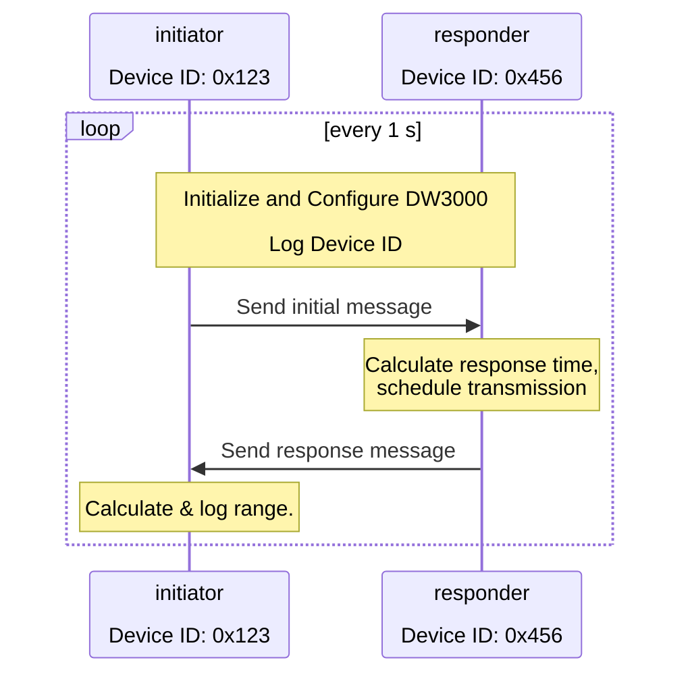

# mn-DWM3001CDK-basics
Basic demonstration of the DWM3001C using the development kit, DWM3001CDK.

I finally got around to playing with the Decawave Module 3001C Development Kits (DWM3001CDKs) that I bought a few years ago.  I bounced off of putting it together back then because I wanted to try to use the tools recommended by the hardware manufacturer (in this case, the nRF Connect extension for VS Code), Nordic, as there's an nRF52833 in the DWM3001C that you use to... use... the UWB transceiver.  This means using Zephyr OS (as opposed to bare metal), since that's the default, and also the only thing thought leaders on LinkedIn talk about.  However, since Zephyr stays true to the OSS model of being openly hostile to users, particularly new users, it took me a while to get up to speed.

Which is why I put this together.  UWB stuff is hard enough, we don't need to fight blank documentation pages for critical peripherals (looking at you, SPI), or sift through novellas about build systems in place of a checklist of how to use the API.  Anyway, my goals for this repo are to:

1. Keep things as simple as possible,
2. Keep things as obvious as possible,
3. Make the configuration (both hardware and firmware) of the DW3000 as easy to access and understand as possible,
4. Make the use of the DW3000 as easy to understand as possible,
5. Document things as best as I can.

The latest Qorvo docs that I could find are in the `.\docs` directory.

To that end, I have built Devicetree bindings for the DW3000 (in `dts\bindings\qorvo,dw3000\worvo,dw3000.yaml`) that define the necessary pins and all config options with documentation from the API guide; an overlay for the decawave_dwm3001cdk Devicetree specification (`.\decawave_dwm3001cdk_nrf52833.overlay`) that includes the DW3000 bindings--including ok default values for the firmware config (slower speeds for longer range); one source file, a big chunk of which is documentation; and a main function demo that builds a hardcoded initiator that sends a message once per second, receiving a response from a responder and calculating a single-sided two-way range.

> **NOTE:** I play things pretty fast and loose with copying structs into buffers and vice-versa; mostly 'cause everything I'm working with is little endian so it just works.  So keep an eye on that if you're porting things to a different setup.

In order to build this project, you need to clone the repo, and first open it up in VS Code with the nRF Connect extension installed (this uses v3.3.0 of the nRF Connect SDK Toolchain--make sure the JLink tools are installed to).  It should auto-detect the application, but you'll have to set up a build configuration.  In the tiny options menu next to the listed `mn-DWM3001CDK-basics` application, click to add a build configuration, then set it up:

| Option                   | Selection |
|-                         |-|
| SDK                      | nRF Connect SDK v3.3.0 |
| Toolchain                | nRF Connect SDK Toolchain v3.3.0 |
| Board target             | `decawave_dwm3001cdk/nrf52833` |
| Base configuration files | `prj.conf`  (in workspace folder) |
| Base Devicetree overlays | `decawave_dwm3001cdk_nrf52833.overlay`  (in workspace folder) |
| Optimization level       | project default, or whatever you want |

I also use a straight copy / paste of the Qorvo DW3 QM33 SDK 1.1.1 that I got off of the Qorvo website in exchange for my e-mail, placed in `lib\dwt_uwb_driver`, but with only the DW3000 driver as that's all I needed.  I also needed to add a line to the `CMakeLists.txt` file in that folder so that it compiled correctly in Zephyr (that is, in Thumb mode), since the nRF52833 is at heart an ARM processor.

## Actually Using the Code

In order to actually *use* this code, you will need two DWM3001CDKs.  These two devices will conduct a single-sided two-way range (SS-TWR) measurement.  One of them will be the initiator, sending the first message of an SS-TWR once per second.  The other will be a responder, responding to that message.

If you plug the J-Link port (the "bottom" USB port, farthest from the UWB antenna, labelled J9), it should get auto-detected by the nRF extension.  You can then hit the build button, and once its complete, hit the flash button.  You can then connect to the device, and it should automatically open up another terminal and start printing out the logs.  

One of the logs before it gets into the main loop, prints out the 64-bit, hexadecimal device ID (a combination of lot ID and part ID) for that DW3000 transceiver.  Take this, and put it into the top of the `.\src\main.c` file as the `INITIATOR_DEVICE_ID`, and this specific device will be the initiator: the device that kicks off the first message of a single sided two-way range.  You'll need to re-build, and then re-flash this device for that to start working, of course.  *Any* other device flashed with this firmware will then act as a responder, and try to respond to this message.  A sequence diagram for how it works could be:

