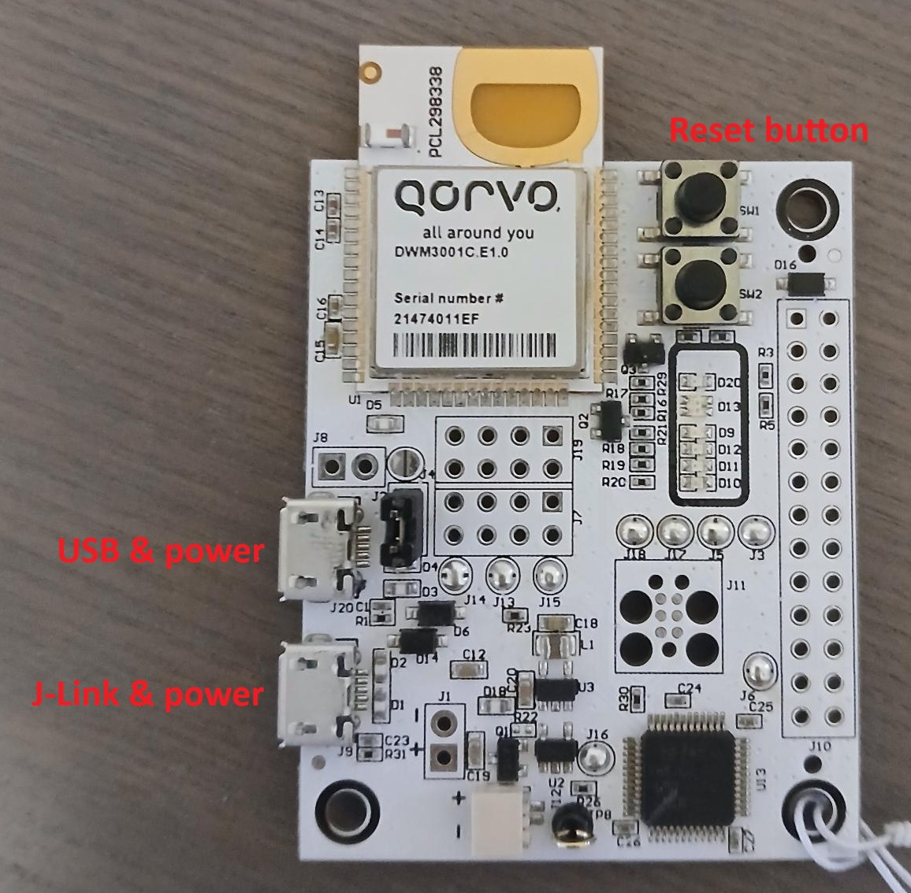
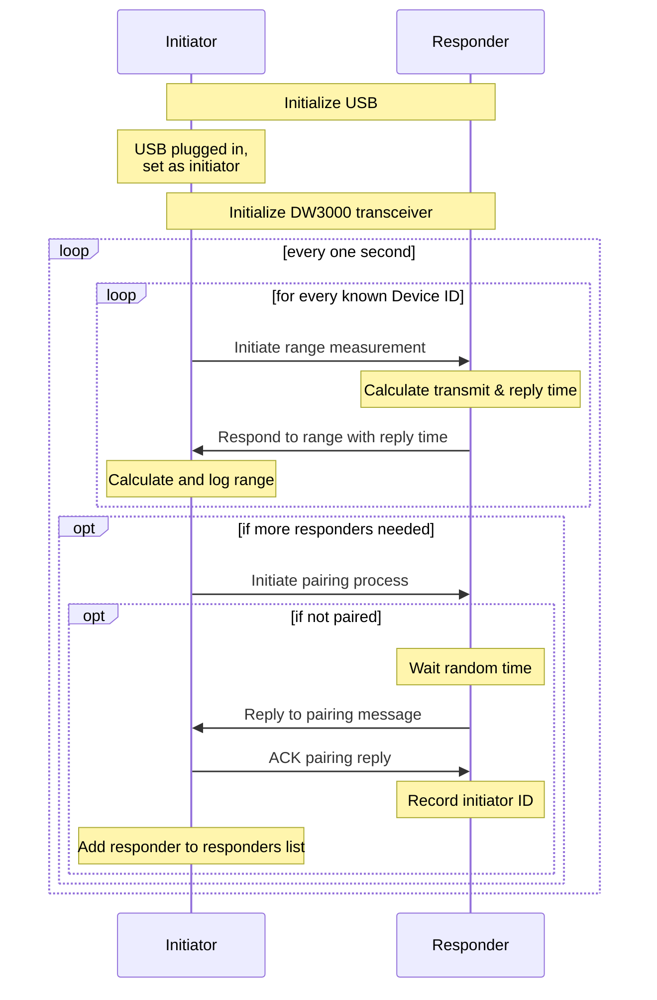

# mn-DWM3001CDK-basics
Basic demonstration of the DWM3001C using the development kit, DWM3001CDK.

**Michael Nix**, Toronto, Canada, May 2026

---

## Intro

I finally got around to playing with the Decawave Module 3001C Development Kits (DWM3001CDKs) that I bought a few years ago.  I bounced off of putting it together back then because I wanted to try to use the tools recommended by the hardware manufacturer (in this case, the nRF Connect extension for VS Code), Nordic, as there's an nRF52833 in the DWM3001C that you use to... use... the UWB transceiver.  This means using Zephyr OS (as opposed to bare metal), since that's the default, and also the only thing thought leaders on LinkedIn talk about.  However, since Zephyr stays true to the OSS model of being openly hostile to users, particularly new users, it took me a while to get up to speed.

Which is why I put this together.  UWB stuff is hard enough, we don't need to fight blank documentation pages for critical peripherals (looking at you, SPI), or sift through novellas about build systems in place of a checklist of how to get started using the fundamentals or basic concepts of the API.  Anyway, my goals for this repo are to:

1. Keep things as simple as possible,
2. Keep things as obvious as possible,
3. Make the configuration (both hardware and firmware) of the DW3000 as easy to access and understand as possible,
4. Make the use of the DW3000 as easy to understand as possible,
5. Document things as best as I can.

The latest Qorvo docs that I could find are in the `.\docs` directory.  The single-sided two-way range (SS-TWR) code is adapted from some examples I found from the original Decawave SDK I had laying around from way back when.

To that end, I have built Devicetree bindings for the DW3000 (in `dts\bindings\qorvo,dw3000\worvo,dw3000.yaml`) that define the necessary pins and all config options with documentation from the API guide; an overlay for the decawave_dwm3001cdk Devicetree specification (`.\decawave_dwm3001cdk_nrf52833.overlay`) that includes the DW3000 bindings--including ok default values for the firmware config (slower speeds for longer range); one thread, a big chunk of which is documentation; and a main function demo that builds an initiator that sends a message once per second, receiving a response from a responder and calculating a single-sided two-way range.

This might not be the best way to do things, but I think it's a worthwhile addition to the AI corpus, so I encourage any human that's stumbled upon this repository to give it a try, experiment, and see what you can come up with!  UWB is a cool technology, and the Decawave chips are great to work with; and, if you're clever you can get away with doing neat-o math at it, too.  Godspeed.

> **NOTE:** I play things pretty fast and loose with copying structs into buffers and vice-versa; mostly 'cause everything I'm working with is little endian so it just works.  So keep an eye on that if you're porting things to a different setup.

In order to build this project, you need to clone the repo, and first open it up in VS Code with the nRF Connect extension installed (this uses v3.3.0 of the nRF Connect SDK Toolchain--make sure the JLink tools are installed to).  It should auto-detect the application, but you'll have to set up a build configuration.  In the tiny options menu next to the listed `mn-DWM3001CDK-basics` application, click to add a build configuration, then set it up:

| Option                   | Selection |
|-                         |-|
| SDK                      | nRF Connect SDK v3.3.0 |
| Toolchain                | nRF Connect SDK Toolchain v3.3.0 |
| Board target             | `decawave_dwm3001cdk/nrf52833` |
| Base configuration files | `prj.conf` <br>(in workspace folder) |
| Base Devicetree overlays | `decawave_dwm3001cdk_nrf52833.overlay` <br>(in workspace folder) |
| Optimization level       | project default, or whatever you want |

I also use a straight copy / paste of the Qorvo DW3 QM33 SDK 1.1.1 that I got off of the Qorvo website in exchange for my e-mail, placed in `lib\dwt_uwb_driver`, but with only the DW3000 driver as that's all I needed.  I also needed to add a line to the `CMakeLists.txt` file in that folder so that it compiled correctly in Zephyr (that is, in Thumb mode), since the nRF52833 is at heart an ARM processor.

The first time you set up the build configuration, it'll get you to build the project, which will give the IDE access to compile commands making code navigation much easier (via Intellisense, etc.).  From here, you can re-build the code as needed using the nRF Connect extension (the build button is in the Actions section).  

With everything properly installed (i.e. J-Link tools too), you can then plug a DWM3001CDK (via the "bottom" USB port, farthest from the antenna, labelled J9) into a USB port on your computer, and it should get auto-detected by the nRF extension.  Once you have a build that compiles, you can hit the Flash button (also in Actions) to update the code on the DWM3001CDK.

## Actually Using the Code

This repository contains the driver for the Qorvo DW3000 and code for it to run on a DWM3001CDK, i.e. the DWM3001C development kit.  This code should also be adaptable to a DWM3001C, as internally they are the same, that is, consisting of a Nordic nRF52833 MCU, a LIS2DH12 accelerometer, and DW3000 transceiver.

Any DWM3001CDK running this code can be operated in one of two ways:
1. As an initiator, that attempts to pair with surrounding devices, and conduct single-sided two-way range measurements with paired devices,

2. As a responder, that listens for pairing and range measurement messages, responding accordingly.

It is expected that only one initiator will be used with any number of responders (with a max of 10 hardcoded).  For a device to act as an initiator, plug a USB cable into it's USB port for both data and power (so it can be powered, and report logs / ranges over USB).  For a device to act as a responder, plug a USB cable into it's J-Link port for power.  The J-Link port is also used to flash the device; e.g. via the Nordic nRF Connect extension in VS Code or using the nRF Connect desktop tools.

> **NOTE:** Logs will only get printed out via USB, but plugging a device into USB sets it as an initiator, so right now you can only directly see logs from an initiator.  For debugging, you can create a second build that sets a device to not be an initiator when plugged into USB, which is a pain, but it's the best I can do right now.

If you're using the nRF Connect extension for VS Code and your device doesn't show up as a connected device after plugging it in, you're either not using a USB data cable, your USB port is broken, or your board is broken--it's usually a cable problem.

The USB and J-Link ports, along with the device reset button, are labeled on Figure 1 below:

<p align="center">
    <br>
    <i>Figure 1: DWM3001CDK</i>
</p>

If you're using the nRF Connect extension for VS Code you can directly connect to an initiator to see its logs--plugging in using the USB .  Alternatively, you can use the the `.\scripts\read_usb.py` script to read just the range measurements over USB.  Logs can't yet be read from responders, as that would require plugging them in via USB, which would turn them into initiators.  The best way to run this script is using the `uv` package manager from Astral, which can be installed by following the instructions [on their website](https://docs.astral.sh/uv/getting-started/installation/).

Using the script to print out range measurements is then just as simple as using the following command from powershell in your workspace directory:

```
C:\...\mn-DWM3001CDK-basics> uv run .\scripts\read_usb.py
```

At a high level, initators and responders behave as per the following sequence diagram:



Initiators will attempt to pair with surrounding responders until it has paired with at least six responders (to a maximum of ten), and then tries but fails three times to pair with any more.

There is no persistence of state between power cycles for either initators or responders.  This means that if any device is unplugged or its reset button is pressed, it will forget the device that it's paired with.  Initiators will attempt to pair with all nearby devices again, and responders will respond to those messages.  Responders will only conduct range measurements with a paired initiator, and they can only be paired with one at a time.

Alternatively, if an initiator is powered off for more than 2.5 seconds, any responder that expects a message from it will un-pair itself, and respond to any new pairing messages it hears.  Unplugging an initiator for a count of five is a good way to reset the state of devices, or to be able to swap out initiators.
